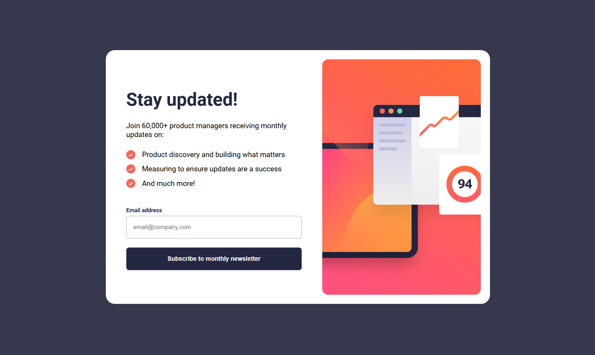

# Frontend Mentor - Newsletter sign-up form with success message solution
## Overview
### The challenge

Users should be able to:

- Add their email and submit the form
- See a success message with their email after successfully submitting the form
- See form validation messages if:
  - The field is left empty
  - The email address is not formatted correctly
- View the optimal layout for the interface depending on their device's screen size
- See hover and focus states for all interactive elements on the page

### Screenshot

### Links

- Live Site URL: https://rui-martins23.github.io/newsletter-signup-from/

## My process
### Built with

- Semantic HTML5 markup
- CSS custom properties
- Flexbox
- CSS Grid
- Mobile-first workflow
- Javascript

### What I learned

Learned how to better use the DOM manipulation, in order to improve the user experience.
Also, the most important aspects of a basic form validation, which shown to be be really crucial

### Useful resources

- [Bro Code] - This helped me for understand basic event listeners type of inputs and also basic form validation.
- [Coding 2 Go] - Really direct, short and nice videos that helped to better understand form validation and basic ways of DOM manipulation.
- [eds HTML] - Helped me tweak some final aspects of this project through its Youtube videos.

## Author

- [@Rui-Martins23] https://www.frontendmentor.io/profile/Rui-Martins23
